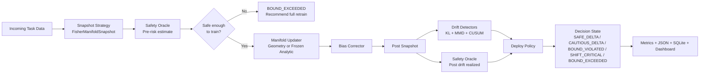

# MELD


**MELD** stands for **Manifold-Equivalent Learning with Deployment guarantees**.
It is a continual learning framework for updating models with **new data only**
while preserving old-task structure through replay-free geometry snapshots,
pre-training risk checks, drift detection, and deployment decisions.

Repository: [anikeaty08/MELD](https://github.com/anikeaty08/MELD)  
Clone URL: [https://github.com/anikeaty08/MELD.git](https://github.com/anikeaty08/MELD.git)

## Why MELD

- `Zero replay`: no proportional exemplar memory, no rehearsal buffer. A fixed budget of ≤20 anchor images per class is stored for backbone re-encoding during geometry loss — this is O(classes), not O(dataset), and does not grow with historical data volume.
- `Pre-update safety`: compute a risk estimate before training starts.
- `Replay-free preservation`: use Fisher, K-FAC, and geometry constraints.
- `Deployment aware`: every task ends with a structured decision state.
- `Benchmark ready`: compare delta updates against full retrain and baselines.

## Architecture



## How It Works

1. Capture replay-free old-task statistics.
2. Compute a pre-training risk estimate from curvature geometry.
3. Skip unsafe updates before training starts.
4. Train only on new-task data with CE + geometry + EWC/K-FAC protection.
5. Measure realized drift after the update.
6. Produce a deployment decision and benchmark outputs.

## Fresh Clone Setup

Activation alone does **not** install dependencies. The install happens when you run
`python -m pip install .`.

### Windows PowerShell

```powershell
git clone https://github.com/anikeaty08/MELD.git
cd MELD
python -m venv .venv
.\.venv\Scripts\Activate.ps1
python -m pip install --upgrade pip
python -m pip install .
python -m meld.bootstrap --datasets CIFAR-10 CIFAR-100 --data-root ./data
```

If activation is blocked:

```powershell
Set-ExecutionPolicy -ExecutionPolicy RemoteSigned -Scope CurrentUser
```

### Windows CMD

```bat
git clone https://github.com/anikeaty08/MELD.git
cd MELD
python -m venv .venv
.venv\Scripts\activate.bat
python -m pip install --upgrade pip
python -m pip install .
python -m meld.bootstrap --datasets CIFAR-10 CIFAR-100 --data-root ./data
```

### macOS / Linux

```bash
git clone https://github.com/anikeaty08/MELD.git
cd MELD
python3 -m venv .venv
source .venv/bin/activate
python -m pip install --upgrade pip
python -m pip install .
python -m meld.bootstrap --datasets CIFAR-10 CIFAR-100 --data-root ./data
```

### Leave The Environment

```bash
deactivate
```

## What Gets Installed

Running `python -m pip install .` installs the runtime defined in
[pyproject.toml](https://github.com/anikeaty08/MELD/blob/main/pyproject.toml), including:

- `datasets`
- `torch`
- `torchvision`
- `continuum`
- `fastapi`
- `uvicorn`
- `numpy`
- `scipy`
- `transformers`

Running `python -m meld.bootstrap ...` downloads datasets into the local `./data`
folder inside the cloned repository.

## Run MELD

### Python API

```python
from meld.api import MELDConfig, TrainConfig, run

results = run(
    MELDConfig(
        dataset="CIFAR-10",
        num_tasks=5,
        classes_per_task=2,
        train=TrainConfig(
            backbone="resnet32",
            epochs=5,
            batch_size=64,
            lr=0.01,
            incremental_strategy="geometry",
        ),
    ),
    results_path="results.json",
)

print(results["final_summary"])
```

### CLI

```bash
python -m meld.cli \
  --dataset CIFAR-10 \
  --num-tasks 5 \
  --classes-per-task 2 \
  --epochs 5 \
  --batch-size 64 \
  --lr 0.01 \
  --num-workers 0 \
  --results-path results.json
```

### Web Dashboard

```bash
python -m meld.web.server
```

Then open [http://127.0.0.1:8080](http://127.0.0.1:8080).

## Project Structure

```text
meld/
|- api.py
|- cli.py
|- interfaces/
|  `- base.py
|- core/
|  |- snapshot.py
|  |- oracle.py
|  |- updater.py
|  |- corrector.py
|  |- drift.py
|  |- policy.py
|  `- weighter.py
|- models/
|  |- backbone.py
|  `- classifier.py
|- benchmarks/
|  |- runner.py
|  |- metrics.py
|  |- avalanche_baselines.py
|  `- storage.py
`- web/
   `- server.py
```

## Datasets

- `CIFAR-10`
- `CIFAR-100`
- `synthetic` for smoke tests only

Use `synthetic` only for tests and development checks. Real dataset runs should
use the active virtual environment with installed `continuum` and `torchvision`.

## Theory Notes

The current MELD oracle exposes:

- empirical pre-training risk estimates
- realized post-training drift audits
- a PAC-style Hoeffding reference gap
- an importance-weighted PAC-equivalence estimate path

The language is intentionally conservative. See
[docs/theory.md](https://github.com/anikeaty08/MELD/blob/main/docs/theory.md).

## Research Links

- [Sugiyama et al. - Direct Importance Estimation with Model Selection and Its Application to Covariate Shift Adaptation](https://www.jmlr.org/papers/v10/sugiyama09a.html)
- [Cortes, Mansour, Mohri - Learning Bounds for Importance Weighting](https://papers.nips.cc/paper_files/paper/2010/hash/1f71e393b3809197ed66df836fe833e5-Abstract.html)
- [Kirkpatrick et al. - Overcoming Catastrophic Forgetting in Neural Networks](https://doi.org/10.1073/pnas.1611835114)
- [Buzzega et al. - Dark Experience for General Continual Learning](https://neurips.cc/virtual/2020/poster/18540)
- [Gretton et al. - A Kernel Two-Sample Test](https://jmlr.org/papers/v13/gretton12a.html)

Related repos:

- [Awesome-Incremental-Learning](https://github.com/xialeiliu/Awesome-Incremental-Learning)
- [Analytic Continual Learning](https://github.com/ZHUANGHP/Analytic-continual-learning)
- [delta reference repo](https://github.com/anikeaty08/delta.git)

## Current Status

Strong areas:

- replay-free continual learning infrastructure
- geometry/Fisher/K-FAC updater path
- decision-aware deployment outputs
- benchmark runner, dashboard, and storage integration

Open tuning areas:

- harder real-data continual stability
- tighter equivalence to full retrain over long task sequences
- deeper Avalanche baseline coverage
