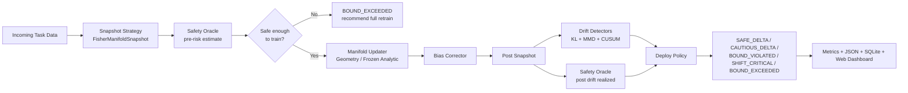

# MELD


MELD stands for **Manifold-Equivalent Learning with Deployment guarantees**.
It is a class-incremental learning framework for updating a model with **new
data only**, while preserving old-task structure through replay-free geometry
statistics, pre-train safety checks, drift detection, and a deployment
decision layer.

## Why MELD

- `Zero replay`: no raw historical images, no exemplar buffer, no rehearsal path.
- `Pre-update safety`: compute a risk estimate before training starts.
- `Replay-free preservation`: protect old structure with Fisher, K-FAC, and geometry terms.
- `Deployment aware`: every task ends with an explicit decision state.
- `Benchmark ready`: compare delta updates against full retrain and baselines.

## Architecture



## How It Works

1. MELD captures a replay-free statistical snapshot of old classes.
2. It computes a **pre-training risk estimate** from Fisher/K-FAC geometry.
3. If the update looks unsafe, MELD skips training and recommends full retrain.
4. If safe, MELD trains only on new-task data using:
   - cross-entropy on new data
   - geometry preservation over stored old-class structure
   - EWC/K-FAC penalties on protected parameters
   - importance weighting for replay-free bias correction
5. After training, MELD measures realized drift and runs the deployment policy.
6. The run is written to JSON, mirrored to SQLite, and exposed through the dashboard.

## Fresh Clone Setup

Activation alone does **not** install dependencies. After creating the virtual
environment, run `python -m pip install .` once.

### Windows PowerShell

```powershell
git clone <your-repo-url>
cd MELD
python -m venv .venv
.\.venv\Scripts\Activate.ps1
python -m pip install --upgrade pip
python -m pip install .
python -m meld.bootstrap --datasets CIFAR-10 CIFAR-100 --data-root ./data
```

If PowerShell blocks activation:

```powershell
Set-ExecutionPolicy -ExecutionPolicy RemoteSigned -Scope CurrentUser
```

### Windows CMD

```bat
git clone <your-repo-url>
cd MELD
python -m venv .venv
.venv\Scripts\activate.bat
python -m pip install --upgrade pip
python -m pip install .
python -m meld.bootstrap --datasets CIFAR-10 CIFAR-100 --data-root ./data
```

### macOS / Linux

```bash
git clone <your-repo-url>
cd MELD
python3 -m venv .venv
source .venv/bin/activate
python -m pip install --upgrade pip
python -m pip install .
python -m meld.bootstrap --datasets CIFAR-10 CIFAR-100 --data-root ./data
```

### Leave The Environment

```bash
deactivate
```

## What Gets Installed

Running `python -m pip install .` installs the runtime defined in
[pyproject.toml](C:/Users/anike/Desktop/MELD/pyproject.toml), including:

- `torch`
- `torchvision`
- `continuum`
- `fastapi`
- `uvicorn`
- `numpy`
- `scipy`

Running `python -m meld.bootstrap ...` downloads datasets into
[data](C:/Users/anike/Desktop/MELD/data).

## Run MELD

### Python API

```python
from meld.api import MELDConfig, TrainConfig, run

results = run(
    MELDConfig(
        dataset="CIFAR-10",
        num_tasks=5,
        classes_per_task=2,
        train=TrainConfig(
            backbone="resnet32",
            epochs=5,
            batch_size=64,
            lr=0.01,
            incremental_strategy="geometry",
        ),
    ),
    results_path="results.json",
)

print(results["final_summary"])
```

### CLI

```bash
python -m meld.cli \
  --dataset CIFAR-10 \
  --num-tasks 5 \
  --classes-per-task 2 \
  --epochs 5 \
  --batch-size 64 \
  --lr 0.01 \
  --num-workers 0 \
  --results-path results.json
```

### Web Dashboard

```bash
python -m meld.web.server
```

Then open [http://127.0.0.1:8080](http://127.0.0.1:8080).

## Project Structure

```text
meld/
├── api.py
├── cli.py
├── interfaces/
│   └── base.py
├── core/
│   ├── snapshot.py
│   ├── oracle.py
│   ├── updater.py
│   ├── corrector.py
│   ├── drift.py
│   ├── policy.py
│   └── weighter.py
├── models/
│   ├── backbone.py
│   └── classifier.py
├── benchmarks/
│   ├── runner.py
│   ├── metrics.py
│   ├── avalanche_baselines.py
│   └── storage.py
└── web/
    └── server.py
```

## Core Decisions

- **Default incremental path**: `geometry`
- **Fast comparison path**: `frozen_analytic`
- **Default safety language**: empirical risk estimates, not overstated formal claims
- **User-facing outputs**: JSON + SQLite + dashboard

## Datasets

- `CIFAR-10`
- `CIFAR-100`
- `synthetic` for smoke tests only

Use `synthetic` only for tests, API checks, and fast development loops. Real
dataset runs should use the installed Continuum + torchvision path from the
active virtual environment.

## Theory Notes

The current MELD oracle exposes:

- empirical pre-training **risk estimates**
- realized post-training **drift audits**
- a simple PAC-style Hoeffding gap reference
- an importance-weighted PAC-equivalence estimate path

The language is intentionally conservative. See
[docs/theory.md](C:/Users/anike/Desktop/MELD/docs/theory.md).

## Research Links

These are the main references behind the current MELD design:

- [Sugiyama et al. — Direct Importance Estimation with Model Selection and Its Application to Covariate Shift Adaptation (JMLR)](https://www.jmlr.org/papers/v10/sugiyama09a.html)
- [Cortes, Mansour, Mohri — Learning Bounds for Importance Weighting (NeurIPS 2010)](https://papers.nips.cc/paper_files/paper/2010/hash/1f71e393b3809197ed66df836fe833e5-Abstract.html)
- [Kirkpatrick et al. — Overcoming Catastrophic Forgetting in Neural Networks (PNAS 2017)](https://doi.org/10.1073/pnas.1611835114)
- [Buzzega et al. — Dark Experience for General Continual Learning (NeurIPS 2020)](https://neurips.cc/virtual/2020/poster/18540)
- [Gretton et al. — A Kernel Two-Sample Test (JMLR)](https://jmlr.org/papers/v13/gretton12a.html)

Useful related repos:

- [Awesome-Incremental-Learning](https://github.com/xialeiliu/Awesome-Incremental-Learning)
- [Analytic Continual Learning](https://github.com/ZHUANGHP/Analytic-continual-learning)
- [delta reference repo](https://github.com/anikeaty08/delta.git)

## Current Status

What MELD is strong at right now:

- replay-free continual learning infrastructure
- geometry/Fisher/K-FAC updater path
- deployment decisions and structured outputs
- benchmark runner + dashboard + storage integration

What still needs careful benchmark tuning:

- stable real-data continual performance on harder CIFAR settings
- stronger equivalence to full retrain on long task sequences
- Avalanche baseline depth and benchmark breadth
