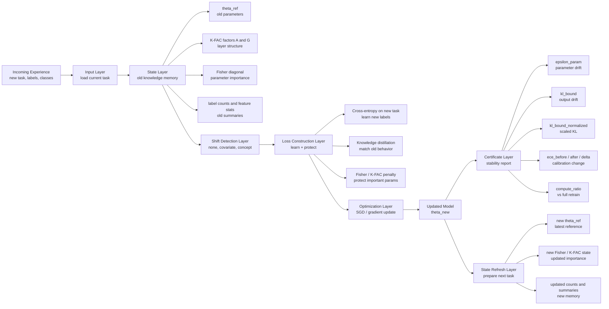
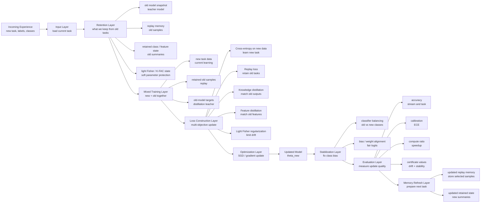

# Full Architecture

This document explains the two architectures separately:

- `FisherDeltaStrategy`
- `DeltaStrategy`

The goal is to keep the explanation simple and layered.

For each strategy, this file explains:

- what enters
- what state is stored
- what penalty is added
- what formulas are used
- what certificate is computed
- why the strategy exists in the framework

---

## 1. FisherDeltaStrategy Architecture

FisherDeltaStrategy is the more mathematical and structured strategy in the framework.

Its main idea is:

> when a new task arrives, the model should learn the new data, but it should not move too far in parameter directions that were important for older tasks.

So this strategy is mainly about:

- storing structured information from the old model
- estimating parameter importance
- penalizing harmful parameter drift
- producing a certificate after the update

### FisherDeltaStrategy Diagram



### FisherDeltaStrategy Layer By Layer

#### Layer 1: Input Layer

What enters:

- new task train dataset
- new task test dataset
- task id
- class ids for the current task

This is wrapped in one `Experience`.

So the strategy never trains on everything at once.
It always receives one task at a time.

#### Layer 2: State Layer

What state is stored:

- `theta_ref`
- `K-FAC A`
- `K-FAC G`
- `fisher_diag`
- label counts
- feature statistics

What each one means:

- `theta_ref`
  old model parameters before the new update
- `K-FAC A` and `K-FAC G`
  structured second-order information for each layer
- `fisher_diag`
  per-parameter importance approximation
- label counts
  old class statistics
- feature statistics
  summaries of old feature behavior

This layer is important because it gives the framework memory without requiring full retraining from scratch every time.

#### Layer 3: Shift Detection Layer

What happens:

- the strategy checks whether the new task looks like:
  - no major shift
  - covariate shift
  - concept shift

Why this matters:

- if the shift is large, the update may be less safe
- this gives context for how trustworthy the update is

#### Layer 4: Loss Construction Layer

This is the core training layer.

The FisherDeltaStrategy loss has three main parts.

##### 4.1 Cross-Entropy on the New Task

This is the ordinary learning term:

```text
CE_new
```

Its job:

- fit the new labels
- learn the new task correctly

Without this term, the model would not adapt to the incoming data.

##### 4.2 Knowledge Distillation

This compares the updated model to the old model.

Its job:

- keep the new model closer to the old model's behavior
- reduce sudden forgetting

In simple words:

> even while learning the new task, the new model should not completely forget how the old model behaved.

##### 4.3 Fisher / K-FAC Penalty

This is the old-knowledge protection term.

The simplest idea is:

```text
Penalty approximately equals
sum over parameters [ importance times (new_param - old_param)^2 ]
```

In plain words:

- if a parameter was important before
- and it changes a lot now
- we add a larger penalty

So the model is free to change, but not equally in all directions.
Important directions are protected more strongly.

#### Layer 5: Formula Layer

There are two main formula ideas here.

##### Formula A: Diagonal Fisher-Style Penalty

```text
L_total = CE_new + lambda * sum_i [ F_i * (theta_i - theta_ref_i)^2 ] + KD
```

Where:

- `CE_new` = new-task cross-entropy
- `KD` = knowledge distillation term
- `F_i` = importance of parameter `i`
- `theta_i` = current parameter
- `theta_ref_i` = old reference parameter

This formula means:

> keep learning the new task, but discourage movement on parameters that mattered a lot before.

##### Formula B: Structured K-FAC Layer Penalty

```text
Penalty = trace(G * DeltaW * A * DeltaW^T)
```

Where:

- `DeltaW` = change in the layer weights
- `A` = input-side factor
- `G` = gradient/output-side factor

Why this matters:

- diagonal Fisher treats parameters independently
- K-FAC keeps layer structure
- so K-FAC is a stronger approximation for real neural network layers

#### Layer 6: Optimization Layer

The full training objective is:

```text
Total Loss = CE_new + KD + Fisher/K-FAC penalty
```

This means:

- learn the new task
- preserve old behavior
- control harmful drift

#### Layer 7: Certificate Layer

After the task is trained, the framework computes a certificate.

What certificate is computed:

- `epsilon_param`
- `kl_bound`
- `kl_bound_normalized`
- `ece_before`
- `ece_after`
- `ece_delta`
- `compute_ratio`
- `is_equivalent`

What they mean:

- `epsilon_param`
  how far the parameters moved
- `kl_bound`
  estimated prediction drift
- `kl_bound_normalized`
  scaled practical version of KL drift
- `ece_before / after / delta`
  confidence calibration before and after the task
- `compute_ratio`
  compute cost relative to full retraining
- `is_equivalent`
  practical indicator of whether the update stayed in the acceptable region

#### Layer 8: State Refresh Layer

After the certificate is computed, the framework updates the stored state:

- new reference parameters
- new Fisher/K-FAC values
- updated label counts
- updated summaries

That updated state is then used for the next task.

### Why FisherDeltaStrategy Is The Theory-Guided Foundation

FisherDeltaStrategy is the theory-guided foundation because:

- it is built around parameter importance
- it uses Fisher and K-FAC as structured mathematical approximations
- it turns old knowledge into a protected state
- it produces certificate-style diagnostics

So this strategy gave the framework its:

- mathematical structure
- controlled update idea
- equivalence / certificate direction

---

## 2. DeltaStrategy Architecture

DeltaStrategy is the more practical architecture in the framework.

Its main idea is:

> do not rely only on parameter penalties. Also retain useful old information directly, combine it with the new data, and stabilize the classifier during the update.

So DeltaStrategy extends the Fisher-based base with stronger practical continual-learning components.

### DeltaStrategy Diagram



### DeltaStrategy Layer By Layer

#### Layer 1: Input Layer

What enters:

- new task train dataset
- new task test dataset
- task id
- new class ids

This is still task-by-task continual learning, just like in FisherDeltaStrategy.

#### Layer 2: Retention Layer

What state is stored:

- old model snapshot
- replay memory
- retained class summaries
- retained feature summaries
- light Fisher / K-FAC state

This is the main practical difference from FisherDeltaStrategy.

Here, the framework does not depend only on parameter importance.
It also retains information that can be used more directly during the next update.

#### Layer 3: Mixed Training Layer

How new data is combined with retained memory:

- take the new task data
- take retained old-task samples or retained memory
- take old model outputs for guidance
- combine them into a mixed training signal

So the strategy learns from:

- what is new
- and what must not be forgotten

This is a key design choice in DeltaStrategy.

#### Layer 4: Loss Construction Layer

The DeltaStrategy loss is richer than the FisherDeltaStrategy loss.

##### 4.1 Cross-Entropy on New Data

```text
CE_new
```

This learns the new task normally.

##### 4.2 Replay Loss

Replay means:

- take retained old-task samples
- include them during training

Its job is:

- remind the model of older tasks
- stop the newest task from dominating completely

##### 4.3 Knowledge Distillation

This keeps the updated model closer to the old model's output behavior.

So even if the model learns something new, it does not completely abandon old predictions.

##### 4.4 Feature Distillation

This preserves internal representations, not only final outputs.

Its job is:

- keep the backbone / feature extractor more stable
- reduce internal forgetting

##### 4.5 Light Fisher Regularization

DeltaStrategy still keeps a lighter Fisher-style penalty.

So it does not throw away the Fisher idea.
It just does not rely on it alone.

#### Layer 5: Formula Layer

The practical DeltaStrategy objective is closer to:

```text
Total Loss = CE_new + Replay + KD + Feature_KD + Light_Fisher
```

In plain words:

- `CE_new`
  learns the new task
- `Replay`
  reminds the model of old tasks
- `KD`
  keeps the new outputs closer to the old outputs
- `Feature_KD`
  keeps the internal representation more stable
- `Light_Fisher`
  still discourages harmful parameter drift

So DeltaStrategy is a combined retention-and-learning architecture.

#### Layer 6: Optimization Layer

The model is updated using the mixed objective above.

This gives the strategy a more practical continual-learning behavior because it learns and retains at the same time.

#### Layer 7: Stabilization Layer

After the main training update, DeltaStrategy also performs stabilization steps.

These include:

- classifier balancing
- bias correction or weight alignment
- task-aware head handling when needed

How replay works:

- a bounded memory of old-task data is stored
- a small amount is reused during later tasks
- this keeps older classes active during future updates

How distillation works:

- the old model is treated as a teacher
- the new model is encouraged to stay close to that teacher

How balancing works:

- newer classes can dominate in continual learning
- balancing reduces that bias

How dynamic heads work:

- when new classes arrive, the classifier grows
- so the architecture adapts to the stream instead of assuming everything is fixed at the beginning

#### Layer 8: Evaluation Layer

Just like FisherDeltaStrategy, this strategy still computes:

- stream accuracy
- per-task accuracy
- calibration change
- compute ratio
- certificate values

So even though DeltaStrategy is more practical, it is still evaluated with the same disciplined reporting structure.

#### Layer 9: Memory Refresh Layer

After evaluation, DeltaStrategy updates:

- replay memory
- old state
- retained summaries

This makes it ready for the next task in the stream.

### What DeltaStrategy Adds Architecturally

DeltaStrategy adds a practical retention path on top of the structured Fisher base:

- direct memory of previous learning
- replay
- distillation
- balancing
- dynamic classifier updates

So if FisherDeltaStrategy is the structured mathematical path,
DeltaStrategy is the practical incremental update path.

---

## 3. Clean Difference Between The Two

### FisherDeltaStrategy

- mathematical / structured path
- relies mainly on parameter importance
- uses Fisher and K-FAC regularization
- certificate-oriented foundation

### DeltaStrategy

- practical incremental path
- mixes new data with retained old information
- uses replay, distillation, balancing, and dynamic heads
- built for stronger practical continual-learning behavior

### Final One-Line Difference

> FisherDeltaStrategy explains how to protect old knowledge mathematically. DeltaStrategy explains how to update a model practically while still preserving old knowledge.
