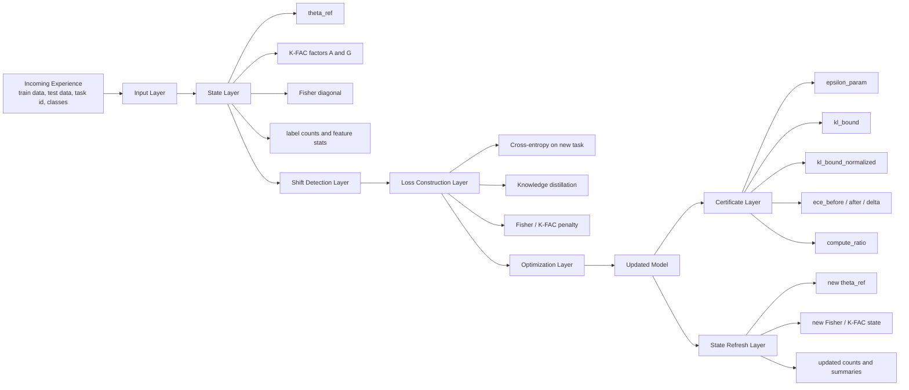
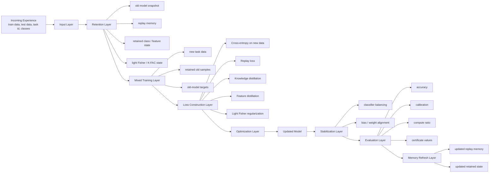

# Full Architecture

## Research Inspiration

This framework is inspired by recent Fisher-based continual-learning work, especially:

- *On the Computation of the Fisher Information in Continual Learning*  
  Gido M. van de Ven, arXiv, February 17, 2025

That paper matters to us because it highlights a key idea:

> in continual learning, the way Fisher information is computed strongly affects how well old knowledge is preserved.

## Where Our Framework Sits

Our framework, `delta-framework`, works in the same continual-learning space as other systems, but it emphasizes:

- delta-style updating
- structured old-task memory
- Fisher / K-FAC guided regularization
- equivalence-style diagnostics
- calibration and compute tracking
- practical and theory-guided strategies in one system

So this file explains the two strategy architectures separately:

- `FisherDeltaStrategy`
- `DeltaStrategy`

---

## 1. FisherDeltaStrategy Architecture

FisherDeltaStrategy is the structured mathematical path.  
It updates the current model on the new task while protecting parameter directions that were important for old tasks.

### FisherDeltaStrategy Diagram



### Layer Summary

- **Incoming Experience / Input Layer**  
  What it does: receives one task at a time and sends it into the Fisher update pipeline.  
  Contains: current task samples, labels, task id, and active classes.

- **State Layer**  
  What it does: loads the old mathematical memory that will guide the protected update.  
  Contains: `theta_ref`, K-FAC `A/G`, Fisher diagonal, label counts, and feature statistics.

  Here `theta_ref` means the saved old model parameters before the new task update.  
  In practice it contains all trainable weights of the old model, for example layer weights, biases, and any other learned parameters.

  Here K-FAC `A` stores activation-side statistics and K-FAC `G` stores gradient-side statistics.  
  Together they approximate which layer directions are important.

  Fisher diagonal means per-parameter importance values used in the regularization term.  
  Label counts store how many examples of each class have been seen, and feature statistics store compact summaries such as means or variances of old representations.

- **Shift Detection Layer**  
  What it does: checks how different the incoming task is from previous tasks before training.  
  Contains: simple shift outcome such as `none`, `covariate`, or `concept`.

- **Loss Construction Layer**  
  What it does: builds the learning objective that learns the new task while protecting old knowledge.  
  Contains: `L_CE`, `L_KD`, and Fisher / K-FAC drift penalty terms.

  `L_CE` is the standard classification loss on the new task.  
  `L_KD` is the distillation loss that keeps new outputs closer to old outputs, and the Fisher / K-FAC term penalizes harmful parameter drift.

- **Optimization Layer**  
  What it does: applies gradient-based updates to the current model using the total FisherDelta loss.  
  Contains: SGD-style parameter update from `theta_ref` toward `theta_new`.

- **Updated Model**  
  What it does: stores the newly updated model after the current task finishes training.  
  Contains: the latest trained weights after the current task update.

- **Certificate Layer**  
  What it does: summarizes how stable, reliable, and efficient the update was after training.  
  Contains: `epsilon_param`, `kl_bound`, `kl_bound_normalized`, `ece_*`, and `compute_ratio`.

  `epsilon_param` measures parameter movement, `kl_bound` measures output drift, and `kl_bound_normalized` is a scaled practical version of that drift.  
  `ece_*` tracks calibration before and after the update, while `compute_ratio` compares delta updating with full retraining cost.

- **State Refresh Layer**  
  What it does: refreshes the stored old-task memory so the next task starts from the latest state.  
  Contains: refreshed reference weights, new Fisher / K-FAC values, and updated summaries.

  New reference weights become the next `theta_ref`.  
  The refreshed Fisher / K-FAC values and summaries are the updated memory carried into the following task.

### Main Formulas

- **Parameter drift**
```text
Delta theta = theta - theta_ref
```

- **Diagonal Fisher importance**
```text
F_i ~= E[(d log p(y|x,theta) / d theta_i)^2]
```

- **Cross-entropy**
```text
L_CE = -log p(y_true)
```

- **Distillation**
```text
L_KD = KL(p_old || p_new)
```

- **Fisher penalty**
```text
L_fisher = sum_i F_i * (theta_i - theta_ref_i)^2
```

- **K-FAC approximation**
```text
F ~= A kron G
```

- **K-FAC layer penalty**
```text
L_KFAC = trace(G * DeltaW * A * DeltaW^T)
```

- **Total FisherDelta objective**
```text
L_total = L_CE + lambda_fisher * L_fisher + lambda_kd * L_KD
```

- **Update rule**
```text
theta <- theta - eta * grad(L_total)
```

### Why It Is The Theory-Guided Foundation

FisherDeltaStrategy is the theory-guided foundation because it is centered on:

- parameter importance
- Fisher / K-FAC approximations
- structured drift control
- certificate-style reporting

---

## 2. DeltaStrategy Architecture

DeltaStrategy is the practical continual-learning path.  
It updates the model using the new task plus retained old information through replay, distillation, balancing, and lighter regularization.

### DeltaStrategy Diagram



### Layer Summary

- **Incoming Experience / Input Layer**  
  What it does: receives the next task in the stream and starts the practical Delta update path.  
  Contains: current task data, labels, task id, and class ids.

- **Retention Layer**  
  What it does: loads the old information that DeltaStrategy will reuse during the new update.  
  Contains: replay samples, old-model copy, retained class / feature summaries, and light regularization state.

  The old-model snapshot is a saved copy of the previous model used as a teacher during distillation.  
  It usually contains the old backbone weights, classifier weights, and other learned parameters needed to reproduce old outputs and features.

  Replay samples are stored old-task examples reused during later updates.  
  Retained class / feature summaries are compact statistics of old classes, and the light regularization state is a softer Fisher-style memory used to limit drift.

- **Mixed Training Layer**  
  What it does: combines current-task data with replayed old samples and teacher outputs before loss computation.  
  Contains: current-task minibatches, replay minibatches, and teacher outputs from the old model.

  Current-task minibatches drive new learning.  
  Replay minibatches and teacher outputs remind the model of older tasks while the new task is being learned.

- **Loss Construction Layer**  
  What it does: builds the multi-objective practical loss used by DeltaStrategy.  
  Contains: `L_CE_new`, `L_CE_replay`, `L_KD`, `L_feat`, and `L_reg`.

  `L_CE_new` learns the new task, `L_CE_replay` refreshes old tasks, and `L_KD` keeps outputs close to the old model.  
  `L_feat` preserves internal features, while `L_reg` softly discourages harmful parameter drift.

- **Optimization Layer**  
  What it does: updates the current model using the combined practical objective.  
  Contains: gradient-based update of the practical multi-loss objective.

- **Updated Model**  
  What it does: stores the incrementally updated model after mixed training completes.  
  Contains: the latest model after learning from both new and retained information.

- **Stabilization Layer**  
  What it does: corrects the classifier so recent classes do not dominate older ones.  
  Contains: balancing steps, bias correction, and weight alignment for the classifier.

  Balancing steps reduce old-vs-new class imbalance.  
  Bias correction and weight alignment adjust classifier outputs so newer classes do not unfairly get larger logits.

- **Evaluation Layer**  
  What it does: measures how good, stable, and efficient the Delta update was.  
  Contains: stream metrics, calibration metrics, compute metrics, and certificate outputs.

  Stream metrics include task-level and overall accuracy.  
  Calibration metrics measure confidence quality, compute metrics measure speedup, and certificate outputs summarize drift and update stability.

- **Memory Refresh Layer**  
  What it does: updates retained memory so the next task can still use old information.  
  Contains: updated replay buffer and refreshed retained state for the next task.

  The replay buffer stores selected old samples for future reuse.  
  The refreshed retained state stores updated summaries and lightweight old-task memory after the current task finishes.

### Main Formulas

- **New-task cross-entropy**
```text
L_CE_new = -log p(y_true | x_new)
```

- **Replay cross-entropy**
```text
L_CE_replay = -log p(y_old | x_old)
```

- **Output distillation**
```text
L_KD = KL(p_old || p_new)
```

- **Feature distillation**
```text
L_feat = || f_old(x) - f_new(x) ||^2
```

- **Light regularization**
```text
L_reg = sum_i importance_i * (theta_i - theta_ref_i)^2
```

- **Total DeltaStrategy objective**
```text
L_total = L_CE_new + lambda_replay * L_CE_replay + lambda_kd * L_KD + lambda_feat * L_feat + lambda_reg * L_reg
```

- **Update rule**
```text
theta <- theta - eta * grad(L_total)
```

### Main Mathematical Focus

DeltaStrategy is mathematically centered on:

- supervised learning on new data
- replay on old data
- output distillation
- feature distillation
- balancing
- lighter regularization

---

## 3. Clean Difference Between The Two

- **FisherDeltaStrategy**  
  Mathematical / structured path focused on parameter protection.

- **DeltaStrategy**  
  Practical / multi-objective path focused on learning plus retention together.

### Final One-Line Difference

> FisherDeltaStrategy explains how to protect old knowledge mathematically. DeltaStrategy explains how to update a model practically while still preserving old knowledge.
