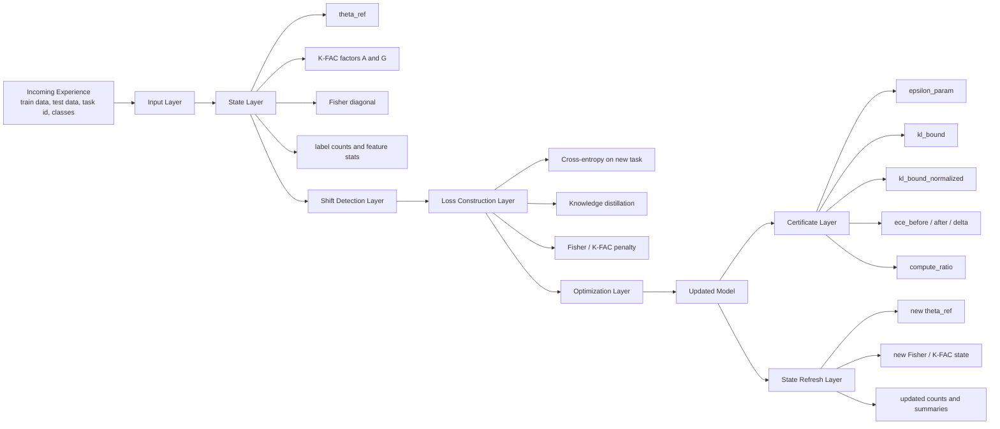
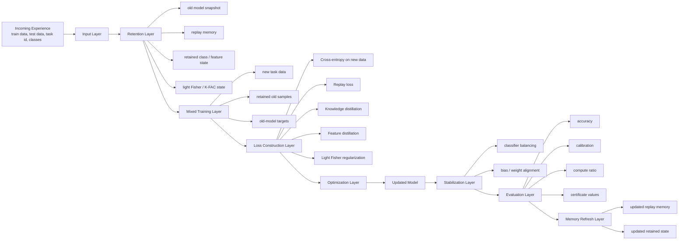

# Full Architecture

## Research Inspiration

This framework is inspired by recent Fisher-based continual-learning work, especially:

- *On the Computation of the Fisher Information in Continual Learning*  
  Gido M. van de Ven, arXiv, February 17, 2025

That paper matters to us because it highlights a key idea:

> in continual learning, the way Fisher information is computed strongly affects how well old knowledge is preserved.

## Where Our Framework Sits

Our framework, `delta-framework`, works in the same continual-learning space as other systems, but it emphasizes:

- delta-style updating
- structured old-task memory
- Fisher / K-FAC guided regularization
- equivalence-style diagnostics
- calibration and compute tracking
- practical and theory-guided strategies in one system

So this file explains the two strategy architectures separately:

- `FisherDeltaStrategy`
- `DeltaStrategy`

---

## 1. FisherDeltaStrategy Architecture

FisherDeltaStrategy is the structured mathematical path.  
It updates the current model on the new task while protecting parameter directions that were important for old tasks.

### FisherDeltaStrategy Diagram



### Layer Summary

- **Incoming Experience / Input Layer**  
  The strategy receives one task at a time: train data, test data, task id, and class ids.  
  This is the new learning problem that enters the update pipeline.

- **State Layer**  
  It loads old reference parameters, Fisher / K-FAC state, and compact task summaries.  
  This is the mathematical memory that tells the model which old knowledge should be protected.

- **Shift Detection Layer**  
  It checks whether the new task looks like normal continuation, covariate shift, or concept shift.  
  This gives context about how safe or risky the next update may be.

- **Loss Construction Layer**  
  The update combines new-task learning with old-knowledge protection through CE, KD, and Fisher / K-FAC regularization.  
  So the model learns the new task without moving too much in important old-task directions.

- **Optimization Layer**  
  The optimizer applies gradient-based updates to the current model.  
  This is a continuation update, not a full restart from random weights.

- **Updated Model**  
  The result is a controlled update from `theta_ref` to `theta_new`.  
  This new model is the latest version carried forward to the next task.

- **Certificate Layer**  
  After training, the framework reports drift, calibration, and compute diagnostics.  
  These values summarize how stable the update was compared to the old model and to full retraining.

- **State Refresh Layer**  
  The new model state becomes the reference for the next task, along with refreshed Fisher / K-FAC summaries.  
  This is how the framework preserves old-task information across the stream.

### Main Formulas

- **Parameter drift**
```text
Delta theta = theta - theta_ref
```

- **Diagonal Fisher importance**
```text
F_i ~= E[(d log p(y|x,theta) / d theta_i)^2]
```

- **Cross-entropy**
```text
L_CE = -log p(y_true)
```

- **Distillation**
```text
L_KD = KL(p_old || p_new)
```

- **Fisher penalty**
```text
L_fisher = sum_i F_i * (theta_i - theta_ref_i)^2
```

- **K-FAC approximation**
```text
F ~= A kron G
```

- **K-FAC layer penalty**
```text
L_KFAC = trace(G * DeltaW * A * DeltaW^T)
```

- **Total FisherDelta objective**
```text
L_total = L_CE + lambda_fisher * L_fisher + lambda_kd * L_KD
```

- **Update rule**
```text
theta <- theta - eta * grad(L_total)
```

### Why It Is The Theory-Guided Foundation

FisherDeltaStrategy is the theory-guided foundation because it is centered on:

- parameter importance
- Fisher / K-FAC approximations
- structured drift control
- certificate-style reporting

---

## 2. DeltaStrategy Architecture

DeltaStrategy is the practical continual-learning path.  
It updates the model using the new task plus retained old information through replay, distillation, balancing, and lighter regularization.

### DeltaStrategy Diagram



### Layer Summary

- **Incoming Experience / Input Layer**  
  The strategy receives the next task in the stream and treats it as a sequential update.  
  The model is extended over time instead of being rebuilt from scratch each time.

- **Retention Layer**  
  It loads replay memory, old-model snapshot, retained summaries, and light Fisher state.  
  This layer gives DeltaStrategy direct access to old information during the new update.

- **Mixed Training Layer**  
  New-task data is mixed with retained old samples and old-model targets.  
  So the strategy trains on what is new while still being reminded of what was learned before.

- **Loss Construction Layer**  
  The objective combines new-task CE, replay CE, output distillation, feature distillation, and light regularization.  
  This makes DeltaStrategy a multi-objective update rather than plain fine-tuning.

- **Optimization Layer**  
  The optimizer updates the current model using the combined practical objective.  
  Each step tries to improve the new task without sacrificing old-task behavior too much.

- **Updated Model**  
  The same model is incrementally adapted into a new version rather than restarted.  
  This updated model becomes the next base model in the continual-learning sequence.

- **Stabilization Layer**  
  Classifier balancing and bias alignment reduce old-vs-new class bias.  
  This is important because recent classes often dominate unless the classifier is corrected.

- **Evaluation Layer**  
  The framework measures accuracy, calibration, compute ratio, and certificate values after the update.  
  So the result is judged not only by accuracy, but also by reliability and efficiency.

- **Memory Refresh Layer**  
  Replay memory and retained summaries are updated after the task finishes.  
  This prepares the strategy for the next task in the stream with refreshed old-task memory.

### Main Formulas

- **New-task cross-entropy**
```text
L_CE_new = -log p(y_true | x_new)
```

- **Replay cross-entropy**
```text
L_CE_replay = -log p(y_old | x_old)
```

- **Output distillation**
```text
L_KD = KL(p_old || p_new)
```

- **Feature distillation**
```text
L_feat = || f_old(x) - f_new(x) ||^2
```

- **Light regularization**
```text
L_reg = sum_i importance_i * (theta_i - theta_ref_i)^2
```

- **Total DeltaStrategy objective**
```text
L_total = L_CE_new + lambda_replay * L_CE_replay + lambda_kd * L_KD + lambda_feat * L_feat + lambda_reg * L_reg
```

- **Update rule**
```text
theta <- theta - eta * grad(L_total)
```

### Main Mathematical Focus

DeltaStrategy is mathematically centered on:

- supervised learning on new data
- replay on old data
- output distillation
- feature distillation
- balancing
- lighter regularization

---

## 3. Clean Difference Between The Two

- **FisherDeltaStrategy**  
  Mathematical / structured path focused on parameter protection.

- **DeltaStrategy**  
  Practical / multi-objective path focused on learning plus retention together.

### Final One-Line Difference

> FisherDeltaStrategy explains how to protect old knowledge mathematically. DeltaStrategy explains how to update a model practically while still preserving old knowledge.
