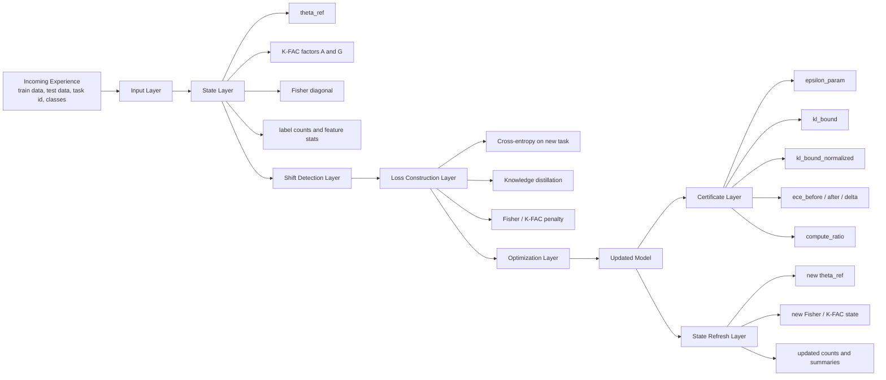
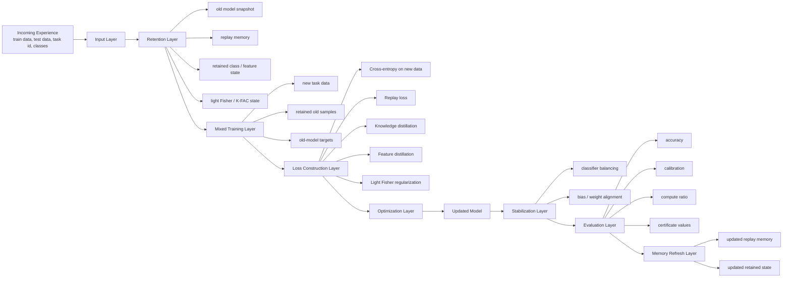

# Full Architecture

## Research Inspiration

This framework is inspired by recent Fisher-based continual-learning work, especially:

- *On the Computation of the Fisher Information in Continual Learning*  
  Gido M. van de Ven, arXiv, February 17, 2025

That paper matters to us because it highlights a key idea:

> in continual learning, the way Fisher information is computed strongly affects how well old knowledge is preserved.

## Where Our Framework Sits

Our framework, `delta-framework`, works in the same continual-learning space as other systems, but it emphasizes:

- delta-style updating
- structured old-task memory
- Fisher / K-FAC guided regularization
- equivalence-style diagnostics
- calibration and compute tracking
- practical and theory-guided strategies in one system

So this file explains the two strategy architectures separately:

- `FisherDeltaStrategy`
- `DeltaStrategy`

---

## 1. FisherDeltaStrategy Architecture

FisherDeltaStrategy is the structured mathematical path.  
It updates the current model on the new task while protecting parameter directions that were important for old tasks.

### FisherDeltaStrategy Diagram



### Layer Summary

- **Incoming Experience / Input Layer**  
  The strategy receives one task at a time: train data, test data, task id, and class ids.  
  Contains: current task samples, labels, task id, and active classes.

- **State Layer**  
  It loads old reference parameters, Fisher / K-FAC state, and compact task summaries.  
  Contains: `theta_ref`, K-FAC `A/G`, Fisher diagonal, label counts, and feature statistics.

  Here `theta_ref` means the saved old model parameters before the new task update.  
  In practice it contains all trainable weights of the old model, for example layer weights, biases, and any other learned parameters.

- **Shift Detection Layer**  
  It checks whether the new task looks like normal continuation, covariate shift, or concept shift.  
  Contains: simple shift outcome such as `none`, `covariate`, or `concept`.

- **Loss Construction Layer**  
  The update combines new-task learning with old-knowledge protection through CE, KD, and Fisher / K-FAC regularization.  
  Contains: `L_CE`, `L_KD`, and Fisher / K-FAC drift penalty terms.

- **Optimization Layer**  
  The optimizer applies gradient-based updates to the current model.  
  Contains: SGD-style parameter update from `theta_ref` toward `theta_new`.

- **Updated Model**  
  The result is a controlled update from `theta_ref` to `theta_new`.  
  Contains: the latest trained weights after the current task update.

- **Certificate Layer**  
  After training, the framework reports drift, calibration, and compute diagnostics.  
  Contains: `epsilon_param`, `kl_bound`, `kl_bound_normalized`, `ece_*`, and `compute_ratio`.

- **State Refresh Layer**  
  The new model state becomes the reference for the next task, along with refreshed Fisher / K-FAC summaries.  
  Contains: refreshed reference weights, new Fisher / K-FAC values, and updated summaries.

### Main Formulas

- **Parameter drift**
```text
Delta theta = theta - theta_ref
```

- **Diagonal Fisher importance**
```text
F_i ~= E[(d log p(y|x,theta) / d theta_i)^2]
```

- **Cross-entropy**
```text
L_CE = -log p(y_true)
```

- **Distillation**
```text
L_KD = KL(p_old || p_new)
```

- **Fisher penalty**
```text
L_fisher = sum_i F_i * (theta_i - theta_ref_i)^2
```

- **K-FAC approximation**
```text
F ~= A kron G
```

- **K-FAC layer penalty**
```text
L_KFAC = trace(G * DeltaW * A * DeltaW^T)
```

- **Total FisherDelta objective**
```text
L_total = L_CE + lambda_fisher * L_fisher + lambda_kd * L_KD
```

- **Update rule**
```text
theta <- theta - eta * grad(L_total)
```

### Why It Is The Theory-Guided Foundation

FisherDeltaStrategy is the theory-guided foundation because it is centered on:

- parameter importance
- Fisher / K-FAC approximations
- structured drift control
- certificate-style reporting

---

## 2. DeltaStrategy Architecture

DeltaStrategy is the practical continual-learning path.  
It updates the model using the new task plus retained old information through replay, distillation, balancing, and lighter regularization.

### DeltaStrategy Diagram



### Layer Summary

- **Incoming Experience / Input Layer**  
  The strategy receives the next task in the stream and treats it as a sequential update.  
  Contains: current task data, labels, task id, and class ids.

- **Retention Layer**  
  It loads replay memory, old-model snapshot, retained summaries, and light Fisher state.  
  Contains: replay samples, old-model copy, retained class / feature summaries, and light regularization state.

  The old-model snapshot is a saved copy of the previous model used as a teacher during distillation.  
  It usually contains the old backbone weights, classifier weights, and other learned parameters needed to reproduce old outputs and features.

- **Mixed Training Layer**  
  New-task data is mixed with retained old samples and old-model targets.  
  Contains: current-task minibatches, replay minibatches, and teacher outputs from the old model.

- **Loss Construction Layer**  
  The objective combines new-task CE, replay CE, output distillation, feature distillation, and light regularization.  
  Contains: `L_CE_new`, `L_CE_replay`, `L_KD`, `L_feat`, and `L_reg`.

- **Optimization Layer**  
  The optimizer updates the current model using the combined practical objective.  
  Contains: gradient-based update of the practical multi-loss objective.

- **Updated Model**  
  The same model is incrementally adapted into a new version rather than restarted.  
  Contains: the latest model after learning from both new and retained information.

- **Stabilization Layer**  
  Classifier balancing and bias alignment reduce old-vs-new class bias.  
  Contains: balancing steps, bias correction, and weight alignment for the classifier.

- **Evaluation Layer**  
  The framework measures accuracy, calibration, compute ratio, and certificate values after the update.  
  Contains: stream metrics, calibration metrics, compute metrics, and certificate outputs.

- **Memory Refresh Layer**  
  Replay memory and retained summaries are updated after the task finishes.  
  Contains: updated replay buffer and refreshed retained state for the next task.

### Main Formulas

- **New-task cross-entropy**
```text
L_CE_new = -log p(y_true | x_new)
```

- **Replay cross-entropy**
```text
L_CE_replay = -log p(y_old | x_old)
```

- **Output distillation**
```text
L_KD = KL(p_old || p_new)
```

- **Feature distillation**
```text
L_feat = || f_old(x) - f_new(x) ||^2
```

- **Light regularization**
```text
L_reg = sum_i importance_i * (theta_i - theta_ref_i)^2
```

- **Total DeltaStrategy objective**
```text
L_total = L_CE_new + lambda_replay * L_CE_replay + lambda_kd * L_KD + lambda_feat * L_feat + lambda_reg * L_reg
```

- **Update rule**
```text
theta <- theta - eta * grad(L_total)
```

### Main Mathematical Focus

DeltaStrategy is mathematically centered on:

- supervised learning on new data
- replay on old data
- output distillation
- feature distillation
- balancing
- lighter regularization

---

## 3. Clean Difference Between The Two

- **FisherDeltaStrategy**  
  Mathematical / structured path focused on parameter protection.

- **DeltaStrategy**  
  Practical / multi-objective path focused on learning plus retention together.

### Final One-Line Difference

> FisherDeltaStrategy explains how to protect old knowledge mathematically. DeltaStrategy explains how to update a model practically while still preserving old knowledge.
