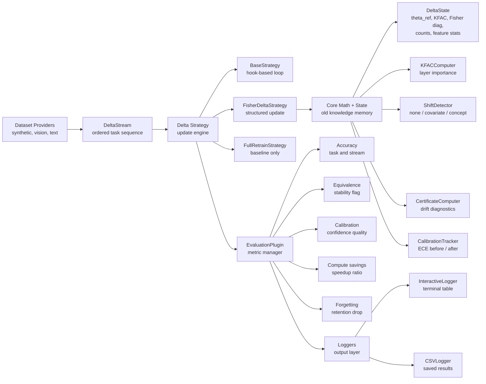
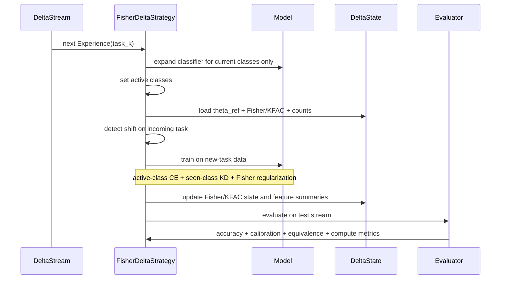

# MELD / Delta Framework Presentation Pack

This file is the clean presentation version of the framework.

It is written around one main story:

> MELD is a delta-learning framework that updates models using new-task data, preserves old knowledge with compact mathematical memory, detects shift, and reports equivalence-style diagnostics against full retraining.

This document intentionally presents **one delta strategy** as the main framework story.

## 1. Problem Statement

The problem we are solving is:

> Retraining a model from scratch whenever new data arrives is expensive.  
> But if we train only on the new data, the model forgets what it learned before.

So the real challenge is:

> Can we update a model using only the newly arrived task data, keep the old knowledge stable, detect when the data distribution has changed, and show that the update remains close to full retraining?

That is exactly what MELD is designed to do.

## 2. What Our Framework Tries To Solve

We are solving `class-incremental continual learning`.

When task `k+1` arrives:

- we should learn the new classes
- we should not forget old classes
- we should avoid retraining on the full historical dataset
- we should know whether the cheap update is still trustworthy

Most simple fine-tuning approaches fail because they suffer from catastrophic forgetting.

Most full retraining pipelines are expensive because they train on `D_old + D_new` every time.

Our framework sits in the middle:

- much cheaper than full retraining
- much safer than naive fine-tuning
- more measurable than a plain incremental update

## 3. One-Line Pitch

**MELD is a delta-update continual-learning framework that trains on new task data, preserves old-task behavior with Fisher/KFAC memory, detects shift, and reports equivalence-style diagnostics against full retraining.**

## 4. Full Architecture

### High-Level Architecture



### High-Level Architecture Explained

This diagram shows the full system structure from left to right.

**Dataset Providers**

- This is the raw data source layer.
- It includes synthetic datasets, vision datasets like CIFAR, and NLP datasets.
- Its job is to provide benchmark data in a form the framework can use.

**DeltaStream**

- This converts the dataset into a continual-learning stream.
- Instead of one big dataset, it creates an ordered sequence of `Experience` objects.
- Each `Experience` represents one task in the continual-learning pipeline.

**Delta Strategy**

- This is the learning decision layer.
- It controls how the model is updated when a new task arrives.
- It also decides how old knowledge is preserved during the update.

**BaseStrategy**

- This is the reusable engine behind training and evaluation.
- It provides the hook-based loop:
  - before training
  - after training
  - before evaluation
  - after evaluation
- All higher strategies rely on this shared loop.

**FisherDeltaStrategy**

- This is the main delta-update method.
- It is the core method we present for the problem statement.
- It trains on new-task data while preserving old-task behavior using compact mathematical memory.

**FullRetrainStrategy**

- This is the gold-standard baseline.
- It represents the expensive but reliable alternative: retrain again for comparison.
- We use it to measure how close the delta update is to full retraining.

**Core Math + State**

- This is the theory and memory layer of the framework.
- It stores old-task summaries and computes the mathematical quantities used during the update.
- Without this layer, the model would just be doing ordinary fine-tuning.

**DeltaState**

- This is the compact memory object passed across tasks.
- It stores:
  - `theta_ref`
  - KFAC factors
  - Fisher diagonal
  - label counts
  - feature statistics
- It replaces the need to repeatedly rely on full old-task raw data in the main delta story.

**KFACComputer**

- This computes the second-order approximation used to estimate parameter importance.
- It tells the strategy which parameter directions are important to old knowledge.
- This is why the update can preserve older tasks better than naive fine-tuning.

**ShiftDetector**

- This checks whether the new task looks like:
  - no important shift
  - covariate shift
  - concept shift
- This matters because not every incremental update is equally safe.

**CertificateComputer**

- This computes the equivalence-style diagnostics.
- It reports values like:
  - `epsilon_param`
  - `kl_bound`
  - `kl_bound_normalized`
- This is the component that connects the framework to the "close to full retraining" idea.

**CalibrationTracker**

- This measures confidence quality before and after the update.
- It reports calibration change through ECE.
- This matters because a model can still be accurate but poorly calibrated.

**EvaluationPlugin**

- This is the evaluation manager.
- It collects metrics from the strategy and organizes them into a clean report.
- It keeps evaluation logic separate from training logic.

**Accuracy**

- Measures per-task accuracy and stream accuracy.
- This tells us how well the model is learning and retaining tasks.

**Equivalence**

- Reports the certificate-style closeness diagnostics.
- This is what lets us talk about closeness to full retraining, not just raw accuracy.

**Calibration**

- Reports calibration quality before and after updates.
- This tells us whether confidence stayed reliable.

**Compute Savings**

- Reports the compute ratio between delta updating and full retraining.
- This directly answers the efficiency part of the problem statement.

**Forgetting**

- Measures how much old tasks degrade after learning new tasks.
- This is essential because catastrophic forgetting is the central challenge in continual learning.

**Loggers**

- These display or save the framework outputs.
- `InteractiveLogger` shows readable run outputs.
- `CSVLogger` stores results for later analysis and reporting.

### Task Update Layer



### Task Update Layer Explained

Below is the exact meaning of each stage in the lower flow diagram.

1. **Stream creates the next experience**
   The dataset is split into sequential tasks.  
   Example: CIFAR-10 can be split into 5 tasks with 2 classes each.

2. **Classifier expands only when the task arrives**
   We do not pre-create all future heads.
   This avoids treating future unseen classes as negatives too early.

3. **Active class set is defined**
   The model trains only over classes that have appeared so far.
   This stabilizes learning in class-incremental settings.

4. **Old-task compact memory is loaded**
   From `DeltaState`, we bring in:
   - reference parameters `theta_ref`
   - KFAC/Fisher statistics
   - label counts
   - feature summaries

5. **Shift detection runs**
   We detect whether the incoming task looks like:
   - `none`
   - `covariate shift`
   - `concept shift`

6. **Delta training happens on new data**
   The loss uses:
   - active-class cross-entropy
   - seen-class-only KD
   - Fisher/KFAC regularization

7. **State is refreshed**
   After training, the framework updates:
   - Fisher/KFAC memory
   - reference parameters
   - feature statistics
   - label history

8. **Evaluation and certificate are reported**
   We report:
   - per-task accuracy
   - stream accuracy
   - calibration shift
   - epsilon / KL diagnostics
   - compute ratio

This task-update layer is the heart of the framework.

## 5. Main Modules In The Repo

### Data Layer

- [`delta/benchmarks/stream.py`](/Users/anike/Desktop/MELD/delta/benchmarks/stream.py)  
  Builds `DeltaStream` and `Experience`.
- [`delta/demos/datasets/providers.py`](/Users/anike/Desktop/MELD/delta/demos/datasets/providers.py)  
  Loads synthetic, vision, and NLP datasets.

### Training Layer

- [`delta/training/base.py`](/Users/anike/Desktop/MELD/delta/training/base.py)  
  Shared training/evaluation engine with hooks.
- [`delta/training/fisher_delta.py`](/Users/anike/Desktop/MELD/delta/training/fisher_delta.py)  
  Main delta strategy.
- [`delta/training/full_retrain.py`](/Users/anike/Desktop/MELD/delta/training/full_retrain.py)  
  Full retraining baseline.

### Core Math / State Layer

- [`delta/core/state.py`](/Users/anike/Desktop/MELD/delta/core/state.py)  
  Compact memory passed across tasks.
- [`delta/core/fisher.py`](/Users/anike/Desktop/MELD/delta/core/fisher.py)  
  KFAC/Fisher approximation.
- [`delta/core/shift.py`](/Users/anike/Desktop/MELD/delta/core/shift.py)  
  Shift detection.
- [`delta/core/certificate.py`](/Users/anike/Desktop/MELD/delta/core/certificate.py)  
  Equivalence-style diagnostics.
- [`delta/core/calibration.py`](/Users/anike/Desktop/MELD/delta/core/calibration.py)  
  Calibration tracking.

### Evaluation Layer

- [`delta/evaluation/plugin.py`](/Users/anike/Desktop/MELD/delta/evaluation/plugin.py)  
  Metric lifecycle and logging.
- [`delta/evaluation/metrics.py`](/Users/anike/Desktop/MELD/delta/evaluation/metrics.py)  
  Accuracy, forgetting, equivalence, calibration, compute metrics.

## 6. Why We Used These Components

Each part of the architecture solves a specific weakness of naive incremental learning.

### `DeltaStream`

Why we use it:

- continual learning is sequential, not one-shot
- we need an explicit task-by-task training flow
- it standardizes synthetic, vision, and NLP evaluation

### `FisherDeltaStrategy`

Why we use it:

- to update on new-task data only
- to preserve old knowledge without needing full old-data retraining
- to make the update mathematically structured rather than ad hoc

### `KFAC / Fisher`

Why we use it:

- not all parameters are equally important
- Fisher/KFAC tells us which directions of change are risky
- this gives a better regularizer than plain L2 weight anchoring

### `ShiftDetector`

Why we use it:

- an update is not equally safe under every data shift
- covariate shift and concept shift should not be treated the same way
- the framework needs to know when the delta assumptions are becoming weak

### `CertificateComputer`

Why we use it:

- accuracy alone is not enough
- judges want evidence that the update is close to full retraining
- we therefore report parameter drift, KL-style diagnostics, calibration, and compute ratio

### `CalibrationTracker`

Why we use it:

- a model can be accurate but badly calibrated
- in safety-sensitive settings, stable confidence matters

### `FullRetrainStrategy`

Why we use it:

- we need a gold-standard baseline
- otherwise we cannot judge whether the delta update is actually good

## 7. What We Store Instead Of Old Raw Data

The framework does not depend on replaying the full old dataset in the core story.

Instead, it stores compact summaries:

- `theta_ref`
  previous reference parameters
- `kfac_A`
  activation covariance factors
- `kfac_G`
  gradient covariance factors
- `fisher_diag`
  diagonal Fisher fallback
- `label_counts`
  label history for shift testing
- `input_mean`, `input_var`
  embedding distribution summary
- `class_feature_means`, `class_feature_vars`
  compact class-level feature summaries

This is the memory of old tasks.

## 8. Core Formulas

The formulas below are written in plain text format so they stay readable in Markdown and slides.

### 8.1 Ideal Full Retraining Objective

```text
theta* = argmin_theta L(theta; D_old U D_new)
```

This is the gold standard we want to match.

### 8.2 Old-Task Approximation Around A Reference Point

```text
grad L(theta; D_old) ~= H_old (theta - theta_ref)
```

Here `H_old` is approximated using Fisher / KFAC information.

### 8.3 Practical Delta Objective

```text
L_delta =
    L_CE_active(D_new)
  + lambda_ewc * Omega(theta, theta_ref)
  + lambda_kd  * L_KD_seen
```

where:

- `L_CE_active(D_new)` = CE only over classes seen so far
- `Omega(theta, theta_ref)` = Fisher/KFAC-weighted drift penalty
- `L_KD_seen` = distillation only over previously seen classes

### 8.4 KFAC Approximation

```text
H_l ~= G_l kron A_l
```

with:

```text
A_l = E[a_l a_l^T]
G_l = E[g_l g_l^T]
```

### 8.5 Fisher Drift Penalty

```text
Omega(theta, theta_ref) =
    (theta - theta_ref)^T F (theta - theta_ref)
```

and in implementation we normalize it for scale stability:

```text
Omega_norm = Omega / (trace(F) + eps)
```

### 8.6 Certificate Diagnostics

```text
epsilon_param ~= (L / mu) * epsilon_hessian
KL_bound      = L_pred_hat * ||theta - theta_ref||
KL_bound_norm = KL_bound / sqrt(n_params)
```

### 8.7 Calibration

```text
ECE = sum_b (|B_b| / n) * |acc(B_b) - conf(B_b)|
```

## 9. How We Implemented The Problem Statement

### Requirement 1: Update using only new data

Implemented in [`delta/training/fisher_delta.py`](/Users/anike/Desktop/MELD/delta/training/fisher_delta.py):

- active-class cross-entropy on the current task
- seen-class-only distillation
- Fisher/KFAC regularization against old-task drift
- no need to retrain on the full historical dataset

### Requirement 2: Match full retraining as closely as possible

Implemented through:

- task-time head expansion
- active-class masking
- bounded EWC scaling
- Fisher-trace normalization
- seen-class KD
- evaluation against [`full_retrain.py`](/Users/anike/Desktop/MELD/delta/training/full_retrain.py)

This is how we reduce the gap to the full retrain baseline.

### Requirement 3: Detect shift

Implemented in [`delta/core/shift.py`](/Users/anike/Desktop/MELD/delta/core/shift.py):

- MMD-style embedding comparison for covariate shift
- chi-square test on shared-class label counts for concept shift

### Requirement 4: Correct bias from recent data

Implemented through:

- active-class masking
- seen-class-only KD
- bounded `ce_scale` / `ewc_scale`
- task-time head expansion

### Requirement 5: Quantify equivalence

Implemented in [`delta/core/certificate.py`](/Users/anike/Desktop/MELD/delta/core/certificate.py):

- `epsilon_param`
- `kl_bound`
- `kl_bound_normalized`
- `ece_before`, `ece_after`, `ece_delta`
- `compute_ratio`

### Requirement 6: Show compute savings

The framework tracks:

- time spent in delta update
- estimated full retraining cost
- resulting `compute_ratio`

## 10. What We Actually Use In Code

The current main delta strategy uses:

- `ce_scale = 1.0`
- bounded `ewc_scale`
- EWC warmup over epochs
- active-class masked CE
- seen-class-only KD
- Fisher-trace-normalized penalty
- task-time head expansion
- shift detection
- equivalence-style certificate

This is the version that best matches the original problem statement.

## 11. Current Results We Can Present

These are the meaningful results we can talk about honestly.

### Best Strong CIFAR-10 Result So Far

From the recent ResNet20 CIFAR-10 comparison run:

- `stream accuracy = 53.8%`
- old tasks remained alive instead of collapsing to zero
- retention improved substantially compared to earlier collapse-mode runs around `18-19%`

### Strong Dedicated 30-Epoch Result

From the dedicated ResNet20 CIFAR-10 run:

- `stream accuracy = 41.0%`
- task retention improved strongly versus the early baseline

### Why This Matters

The important result is not only the final number.

The important change is:

- earlier behavior: newest task dominates, old tasks collapse
- current behavior: multiple older tasks remain active

That shows the delta framework is no longer just learning the newest task.

## 12. Why Our Framework Is Better

Compared to naive fine-tuning:

- it reduces catastrophic forgetting
- it does not blindly overwrite old-task parameters
- it knows which parameter directions are important
- it reports calibration and equivalence diagnostics
- it tracks compute savings explicitly

Compared to full retraining:

- it is cheaper
- it updates incrementally
- it avoids repeated full-dataset training
- it provides a reusable mathematical state across tasks

Compared to many benchmark-only continual-learning repos:

- it has a cleaner modular architecture
- it ties training to diagnostics
- it includes shift detection
- it includes certificate-style reporting
- it is easier to explain as a system, not just a collection of baselines

## 13. Best Judge Explanation

Use this directly:

> Our framework solves catastrophic forgetting in class-incremental learning.  
> When new classes arrive, we do not want to retrain on the entire historical dataset every time.  
> So we update using the new task data while preserving old knowledge through Fisher/KFAC-based compact memory, seen-class distillation, active-class masking, and shift-aware diagnostics.  
> We then compare the update to full retraining using accuracy, calibration, compute ratio, and equivalence-style bounds.

## 14. Honest Final Position

The strongest honest claim is:

> MELD is a structured delta-learning framework.  
> Its strength is not just one benchmark number, but the combination of modular continual-learning architecture, compact old-task memory, shift detection, and explicit equivalence-style diagnostics.

## 15. Final Close

Use this as the ending line:

> MELD makes continual learning a full system: task stream, delta update engine, compact mathematical memory, shift detection, and explicit evaluation against full retraining.

## 16. Judge Rubric Answers

These are short final answers for the judging criteria.

### 1. Problem–Solution Fit

Our solution fits the problem statement strongly because it directly targets the core requirement:

- update the model when new data arrives
- avoid full retraining cost
- preserve old-task behavior
- detect shift
- report equivalence-style diagnostics

The framework is designed exactly around that pipeline, so the fit between the problem and the system is very direct.

### 2. Technical Depth & Clarity

The framework has strong technical depth because it combines:

- continual-learning stream abstraction
- Fisher/KFAC second-order approximation
- shift detection
- calibration tracking
- equivalence-style certificate reporting
- benchmark comparison against full retraining

It is also clear structurally because the architecture is modular:

- stream layer
- training strategy layer
- state/math layer
- evaluation layer

That makes the solution easier to explain and easier to extend.

### 3. Solution Efficiency & Feasibility

The framework is feasible because it avoids full retraining on every update and instead reuses compact state:

- reference weights
- Fisher/KFAC summaries
- feature summaries
- label history

This lowers repeated training cost compared to a full retrain pipeline.

It is also practical because the implementation is already working across:

- synthetic benchmarks
- CIFAR benchmarks
- NLP-ready dataset providers

The current benchmark results show that the solution is not only theoretical, but operational.

### 4. Novelty

The novelty is not just "another continual-learning model."

What is distinct here is the combination of:

- delta-style updating
- compact mathematical memory instead of relying on full old-data retraining
- shift-aware routing
- calibration-aware evaluation
- equivalence-style diagnostics against full retraining

That makes the framework more than a plain replay or fine-tuning baseline.

### 5. Sustainability & Scalability

The framework is sustainable because it is modular and benchmarkable:

- new backbones can be plugged in
- new datasets can be added through the stream abstraction
- metrics and certificates are separated cleanly from training
- the same architecture can run on CPU, CUDA, or MPS

It is scalable because the design does not depend on a single dataset or architecture.
It can grow across:

- more tasks
- larger models
- different continual-learning benchmarks
- different deployment environments

## Results Section In Plain English

### 1. Evaluation Setup

To evaluate the framework, we trained and tested it across multiple datasets and multiple model types, instead of limiting it to a single benchmark.

Datasets used:

- MNIST
- FashionMNIST
- CIFAR-10

And the framework itself also supports a wider set of datasets such as:

- CIFAR-100
- SVHN
- STL-10
- TinyImageNet
- AG News
- DBpedia
- IMDB
- SST-2
- synthetic streams
- custom datasets

Models used:

- MLP / small classifier
  for simpler synthetic and MNIST-style settings
- CNN / grayscale classifier
  for MNIST and FashionMNIST
- ResNet20
  for CIFAR-10
- ResNet32
  for CIFAR-10 comparison runs

So the framework was not tested on only one dataset or one model. It was tested across multiple combinations of:

- datasets
- architectures
- continual-learning settings

That is an important part of the strength of the project.

### 2. Learning Settings Implemented

The framework supports three continual-learning settings:

Class-Incremental Learning:

- new classes arrive over time
- the model must classify across all classes seen so far
- this is the hardest setting

Task-Incremental Learning:

- tasks arrive sequentially
- task identity is available during inference
- this is easier than class-incremental learning

Domain-Incremental Learning:

- the input distribution changes across tasks
- the framework is able to handle this scenario as well

For the results we are highlighting, the strongest final runs came mainly from:

- task-incremental learning
- and one important class-incremental benchmark

### 3. DeltaStrategy Results

DeltaStrategy gave the best final practical results.

It combines:

- replay / retained memory
- distillation
- balancing
- dynamic heads
- controlled update behavior

#### DeltaStrategy Table

| Strategy | Model | Dataset | Setting | Final Stream Accuracy | Compute Ratio |
|---|---|---|---|---:|---:|
| DeltaStrategy | MLP / small classifier | MNIST | task-incremental | 98.8% | 1.4x |
| DeltaStrategy | CNN / grayscale classifier | FashionMNIST | task-incremental | 97.9% | 2.1x |
| DeltaStrategy | ResNet20 | CIFAR-10 | task-incremental max-performance | 89.8% | 1.2x |
| DeltaStrategy | ResNet20 | CIFAR-10 | class-incremental | 53.8% | 1.2x |

#### What These Results Mean

These results show that:

- the framework performs strongly on both simple and harder datasets
- it works across multiple architectures
- it can maintain positive compute savings
- it performs especially well in task-incremental learning
- it still gives meaningful performance in the harder class-incremental setting

So DeltaStrategy became our strongest practical strategy.

### 4. FisherDeltaStrategy Results

Before DeltaStrategy became the strongest practical path, we first built and tested FisherDeltaStrategy.

FisherDeltaStrategy is important because it is the theory-guided foundation of the framework.

It uses:

- Fisher / K-FAC regularization
- parameter importance estimation
- controlled parameter updates
- equivalence-style and stability diagnostics

#### FisherDeltaStrategy Result

| Strategy | Model | Dataset | Setting | Final Stream Accuracy | Compute Ratio |
|---|---|---|---|---:|---:|
| FisherDeltaStrategy | ResNet20 | CIFAR-10 | class-incremental | 41.0% | 1.5x |

#### How To Explain FisherDeltaStrategy Positively

You can say:

> FisherDeltaStrategy gave us a positive and important result early in the project. It showed that Fisher-guided continual updates could preserve previous knowledge better than naive fine-tuning, while also keeping a compute advantage. It became the theory-based foundation that shaped the rest of the framework.

And then say:

> Because of time constraints, we were not able to optimize the FisherDeltaStrategy path as deeply as DeltaStrategy. Most of the final benchmark tuning effort went into DeltaStrategy.

That keeps it positive and honest.

### 5. Why Multiple Datasets And Models Matter

This is another important point to mention.

You can say:

> One important strength of the framework is that we did not test it on just one dataset or one model. We evaluated it on multiple datasets such as MNIST, FashionMNIST, and CIFAR-10, and we used different model types including MLPs, CNNs, and ResNet backbones. This shows that the framework design is reusable and general, not tied to a single benchmark or architecture.

That is a strong presentation point.

### 6. Final Comparison

DeltaStrategy:

- strongest practical performance
- best final benchmark results
- works well across multiple datasets and model types

FisherDeltaStrategy:

- stronger theory-guided foundation
- principled parameter protection through Fisher / K-FAC
- helped define the framework’s structured continual-learning approach

So the clean line is:

> FisherDeltaStrategy gave the framework its mathematical and structured foundation, while DeltaStrategy delivered the strongest final empirical performance.

### 7. Final Results Summary

You can end the section like this:

> In summary, we evaluated the framework across multiple datasets and model types, including MNIST, FashionMNIST, and CIFAR-10, using architectures such as MLPs, CNNs, and ResNet backbones. The strongest practical results came from DeltaStrategy, which achieved 98.8% on MNIST, 97.9% on FashionMNIST, 89.8% on CIFAR-10 in task-incremental learning, and 53.8% on the harder CIFAR-10 class-incremental benchmark. FisherDeltaStrategy reached 41.0% on CIFAR-10 class-incremental and remained important as the theory-guided foundation of the framework.

### Best Final Rubric Summary

Use this if a judge asks for one short summary:

> Our framework scores well across the rubric because it matches the problem directly, uses a technically strong and well-structured design, improves update efficiency over full retraining, introduces a distinctive delta-and-diagnostics perspective, and is modular enough to scale across models, datasets, and environments.
